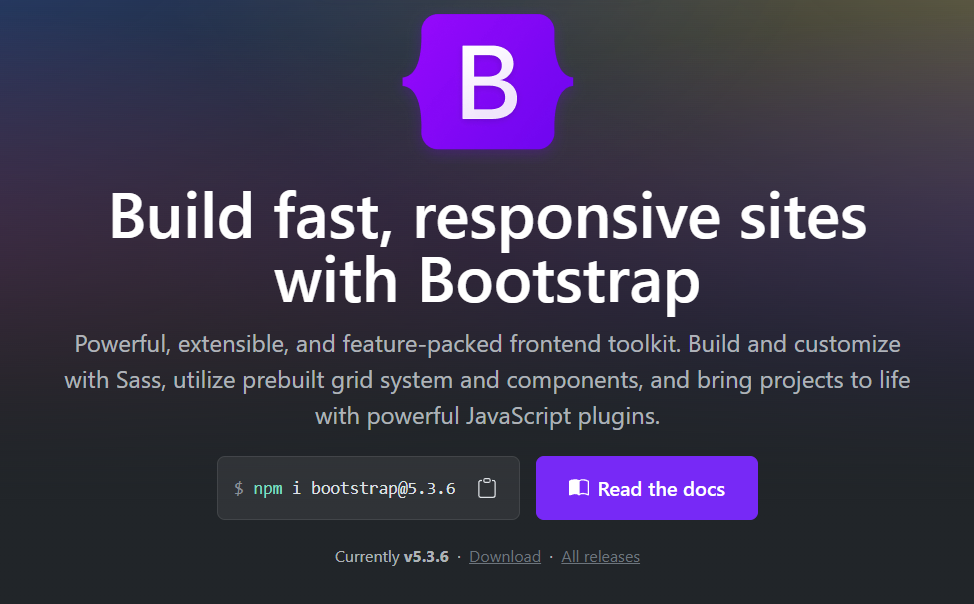

<!--
_class: lead
_paginate: skip
-->

# Bootstrap

[https://getbootstrap.com/](https://getbootstrap.com/)



---

## Pengenalan & Dasar Bootstrap

Bootstrap adalah framework CSS open-source yang dikembangkan oleh tim Twitter pada tahun 2011. Tujuannya adalah untuk memudahkan developer membangun antarmuka web yang responsif dan konsisten tanpa harus menulis semua CSS dari nol.

---

**Kelebihan:**

- Responsif dan mobile-first
- Banyak komponen siap pakai
- Konsistensi antar browser
- Dokumentasi lengkap

---

### **Instalasi dan Setup**

**Menggunakan CDN:**

```html
<!DOCTYPE html>
<html lang="en">
  <head>
    <link
      href="https://cdn.jsdelivr.net/npm/bootstrap@5.3.6/dist/css/bootstrap.min.css"
      rel="stylesheet"
      integrity="sha384-4Q6Gf2aSP4eDXB8Miphtr37CMZZQ5oXLH2yaXMJ2w8e2ZtHTl7GptT4jmndRuHDT"
      crossorigin="anonymous"
    />
  </head>
  <body>
    <script
      src="https://cdn.jsdelivr.net/npm/bootstrap@5.3.6/dist/js/bootstrap.bundle.min.js"
      integrity="sha384-j1CDi7MgGQ12Z7Qab0qlWQ/Qqz24Gc6BM0thvEMVjHnfYGF0rmFCozFSxQBxwHKO"
      crossorigin="anonymous"
    ></script>
  </body>
</html>
```
