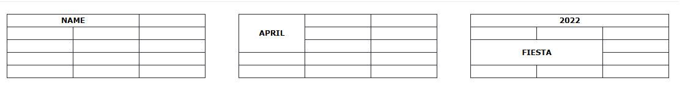

<!-- 
_class: lead 
_paginate: skip
-->

# HTML Table dan Form Elements

---

## 🔹 HTML Table Elements

### 1. `<table>`
- **Penjelasan:** Elemen utama untuk membuat tabel.
- **Contoh:**
  ```html
  <table border="1">
    <!-- baris dan data di dalamnya -->
  </table>
  ```

---

### 2. `<tr>` (Table Row)
- **Penjelasan:** Digunakan untuk membuat baris dalam tabel.
- **Contoh:**
  ```html
  <tr>
    <td>Data 1</td>
    <td>Data 2</td>
  </tr>
  ```

---

### 3. `<th>` (Table Header)
- **Penjelasan:** Digunakan untuk membuat judul kolom (biasanya teks dicetak tebal dan rata tengah).
- **Contoh:**
  ```html
  <tr>
    <th>Nama</th>
    <th>Usia</th>
  </tr>
  ```

---

### 4. `<td>` (Table Data)
- **Penjelasan:** Menampung data dalam kolom tabel.
- **Contoh:**
  ```html
  <tr>
    <td>John</td>
    <td>25</td>
  </tr>
  ```

---

### 5. `<thead>`, `<tbody>`, `<tfoot>`
- **Penjelasan:**
  - `<thead>`: Bagian kepala tabel.
  - `<tbody>`: Isi utama tabel.
  - `<tfoot>`: Bagian bawah tabel (biasanya untuk ringkasan atau total).

---

- **Contoh:**
  ```html
  <table border="1">
    <thead>
      <tr>
        <th>Nama</th>
        <th>Nilai</th>
      </tr>
    </thead>
    <tbody>
      <tr>
        <td>Andi</td>
        <td>90</td>
      </tr>
    </tbody>
    <tfoot>
      <tr>
        <td>Total</td>
        <td>175</td>
      </tr>
    </tfoot>
  </table>
  ```

---

### 6. `colspan` dan `rowspan`
- **Penjelasan:**
  - `colspan`: Menggabungkan kolom.
  - `rowspan`: Menggabungkan baris.

---



---

- **Contoh:**
  ```html
  <table border="1">
    <tr>
      <th rowspan="2">Nama</th>
      <th colspan="2">Nilai</th>
    </tr>
    <tr>
      <th>Ujian 1</th>
      <th>Ujian 2</th>
    </tr>
    <tr>
      <td>Rina</td>
      <td>80</td>
      <td>85</td>
    </tr>
  </table>
  ```

---

## 🔹 HTML Form Elements

### 1. `<form>`
- **Penjelasan:** Elemen utama untuk membuat form.
- **Atribut penting:** `action`, `method`
- **Contoh:**
  ```html
  <form action="/submit" method="post">
    <!-- elemen form lainnya -->
  </form>
  ```

---

### 2. `<input>`
- **Penjelasan:** Input umum (teks, password, email, radio, checkbox, dsb.)
- **Contoh berbagai tipe input:**
  ```html
  <input type="text" name="nama" placeholder="Masukkan nama">
  <input type="password" name="sandi" placeholder="Masukkan sandi">
  <input type="email" name="email">
  <input type="checkbox" name="hobi" value="Membaca"> Membaca
  <input type="radio" name="gender" value="L"> Laki-laki
  <input type="radio" name="gender" value="P"> Perempuan
  ```

---

### 3. `<label>`
- **Penjelasan:** Label teks untuk elemen form, bisa dikaitkan dengan atribut `for`.
- **Contoh:**
  ```html
  <label for="nama">Nama:</label>
  <input type="text" id="nama" name="nama">
  ```

---

### 4. `<textarea>`
- **Penjelasan:** Area teks untuk input lebih panjang.
- **Contoh:**
  ```html
  <label for="pesan">Pesan:</label><br>
  <textarea id="pesan" name="pesan" rows="4" cols="50"></textarea>
  ```

---

### 5. `<select>` dan `<option>`
- **Penjelasan:** Digunakan untuk membuat dropdown.
- **Contoh:**
  ```html
  <label for="kota">Pilih Kota:</label>
  <select id="kota" name="kota">
    <option value="jakarta">Jakarta</option>
    <option value="bandung">Bandung</option>
    <option value="surabaya">Surabaya</option>
  </select>
  ```

---

### 6. `<button>` dan `<input type="submit">`
- **Penjelasan:** Tombol untuk mengirim form.
- **Contoh:**
  ```html
  <button type="submit">Kirim</button>
  <!-- atau -->
  <input type="submit" value="Kirim">
  ```

---

### 7. Atribut Validasi Form
- **Contoh atribut:**
  - `required` → wajib diisi
  - `maxlength`, `minlength`
  - `pattern` → regex untuk validasi
- **Contoh:**
  ```html
  <input type="text" name="username" required minlength="4">
  <input type="email" name="email" required>
  ```
