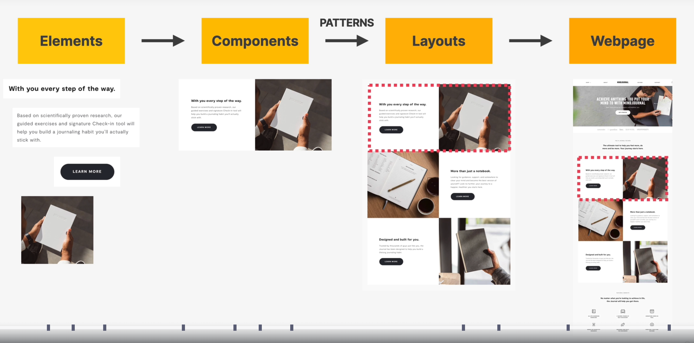
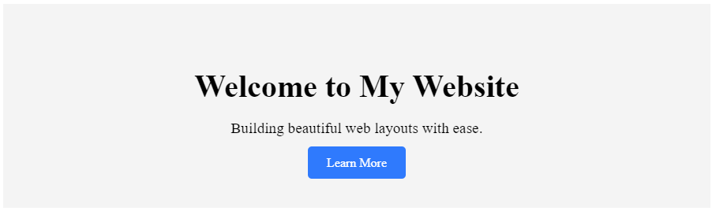
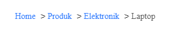
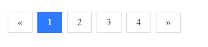
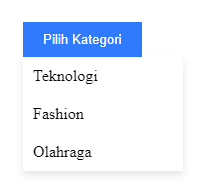
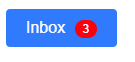
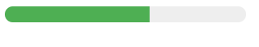
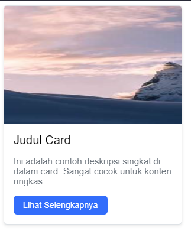

<!--
_class: lead
_paginate: skip
-->

# Web Design Components


---

## From Elements to Web Pages



---

## Website Layout Components

- Navbar (Navigation Bar)
- Hero Section
- Footer
- Breadcrumbs
- Pagination
- Dropdown Menu
- Badge
- Progress Bar
- Card

---

### Navbar (Navigation Bar)

Navbar adalah komponen navigasi utama pada halaman web yang biasanya terletak di bagian atas (top) halaman. Fungsinya untuk memudahkan pengguna berpindah antar halaman atau bagian dalam situs.


---

```html
<nav class="navbar">
  <div class="logo">MySite</div>
  <ul class="nav-links">
    <li><a href="#">Home</a></li>
    <li><a href="#">About</a></li>
    <li><a href="#">Services</a></li>
    <li><a href="#">Contact</a></li>
  </ul>
</nav>
```

---

```css
/* Navbar */
.navbar {
  display: flex;
  justify-content: space-between;
  align-items: center;
  background: #1e1e2f;
  padding: 1rem 2rem;
  color: white;
}

.navbar .nav-links {
  list-style: none;
  display: flex;
  gap: 1rem;
}

.navbar .nav-links a {
  color: white;
  text-decoration: none;
}
```

---

### Hero Section

Hero section adalah area besar dan mencolok yang biasanya langsung terlihat saat halaman dibuka. Komponen ini bertujuan menarik perhatian dan menampilkan pesan utama.



---

```html
<!-- Hero Section -->
<section class="hero">
  <h1>Welcome to My Website</h1>
  <p>Building beautiful web layouts with ease.</p>
  <a href="#" class="btn">Learn More</a>
</section>
```

---

```css
/* Hero Section */
.hero {
  background: #f4f4f4;
  text-align: center;
  padding: 3rem 1rem;
}

.hero h1 {
  font-size: 2.5rem;
  margin-bottom: 1rem;
}

.hero p {
  font-size: 1.2rem;
  margin-bottom: 1.5rem;
}

.hero .btn {
  padding: 0.75rem 1.5rem;
  background: #007bff;
  color: white;
  text-decoration: none;
  border-radius: 5px;
}
```

---

### Footer

Bagian paling bawah dari halaman web yang biasanya berisi informasi tambahan atau navigasi sekunder.


---

```html
<!-- Footer -->
<footer class="footer">
  <p>&copy; 2025 MySite. All rights reserved.</p>
</footer>
```

```css
/* Footer */
.footer {
  background: #1e1e2f;
  color: white;
  text-align: center;
  padding: 1rem;
  margin-top: 2rem;
}
```

---

### Breadcrumbs

Breadcrumbs (atau "jejak navigasi") adalah komponen navigasi yang menunjukkan **lokasi pengguna dalam struktur hierarki** situs web.



---

```html
<nav class="breadcrumbs">
  <a href="#">Home</a> &gt; <a href="#">Produk</a> &gt;
  <a href="#">Elektronik</a> &gt;
  <span>Laptop</span>
</nav>
```

```css
.breadcrumbs {
  font-size: 14px;
  margin: 20px;
}

.breadcrumbs a {
  color: #007bff;
  text-decoration: none;
  margin-right: 5px;
}

.breadcrumbs span {
  color: #555;
}
```

---

### Pagination

Pagination adalah komponen yang digunakan untuk **membagi konten panjang menjadi beberapa halaman**, agar pengguna tidak harus scroll terlalu jauh.



---

```html
<div class="pagination">
  <a href="#">&laquo;</a>
  <a href="#" class="active">1</a>
  <a href="#">2</a>
  <a href="#">3</a>
  <a href="#">4</a>
  <a href="#">&raquo;</a>
</div>
```

---

```css
.pagination {
  display: inline-block;
  margin: 20px;
}

.pagination a {
  color: black;
  float: left;
  padding: 8px 16px;
  text-decoration: none;
  border: 1px solid #ddd;
  margin: 0 4px;
}

.pagination a.active {
  background-color: #007bff;
  color: white;
  border: 1px solid #007bff;
}

.pagination a:hover:not(.active) {
  background-color: #ddd;
}
```

---

### Dropdown Menu

Dropdown menu adalah komponen yang **menampilkan daftar pilihan ketika pengguna mengklik atau hover** pada elemen tertentu.




---

```html
<div class="dropdown">
  <button class="dropbtn">Pilih Kategori</button>
  <div class="dropdown-content">
    <a href="#">Teknologi</a>
    <a href="#">Fashion</a>
    <a href="#">Olahraga</a>
  </div>
</div>
```

---

```css
.dropdown {
  position: relative;
  display: inline-block;
  margin: 20px;
}

.dropbtn {
  padding: 10px 20px;
  background-color: #007bff;
  color: white;
  border: none;
  cursor: pointer;
}
```

---

```css
.dropdown-content {
  display: none;
  position: absolute;
  background-color: white;
  min-width: 160px;
  box-shadow: 0 4px 8px rgba(0, 0, 0, 0.1);
  z-index: 1;
}

.dropdown-content a {
  color: black;
  padding: 10px;
  display: block;
  text-decoration: none;
}

.dropdown-content a:hover {
  background-color: #f1f1f1;
}

.dropdown:hover .dropdown-content {
  display: block;
}
```

---

### Badge

Menampilkan angka kecil atau label kecil di atas elemen lain untuk memberikan informasi tambahan.



---

```html
<button>Inbox <span class="badge">3</span></button>
```

```css
.badge {
  background-color: red;
  color: white;
  padding: 2px 8px;
  border-radius: 12px;
  font-size: 12px;
  margin-left: 5px;
}
```

---

### Progress Bar

Menampilkan kemajuan dari suatu proses dalam bentuk visual.



---

```html
<div class="progress-bar">
  <div class="progress" style="width: 60%;"></div>
</div>
```

```css
.progress-bar {
  background: #eee;
  border-radius: 10px;
  overflow: hidden;
  height: 20px;
  width: 100%;
  max-width: 300px;
}

.progress {
  height: 100%;
  background-color: #4caf50;
}
```

---

### Card

Lomponen UI (User Interface) yang digunakan untuk menampilkan konten dalam bentuk blok persegi atau persegi panjang. Biasanya digunakan untuk menampilkan informasi ringkas seperti gambar, judul, deskripsi, dan tombol aksi.



---

```html
<div class="card">
    
    <div class="card-body">
        <h5 class="card-title">Judul Card</h5>
        <p class="card-text">Ini adalah contoh deskripsi singkat di dalam card. Sangat cocok untuk konten ringkas.
        </p>
        <a href="#" class="btn">Lihat Selengkapnya</a>
    </div>
</div>
```

---

```css
.card {
    width: 300px;
    border: 1px solid #dee2e6;
    border-radius: 0.375rem;
    box-shadow: 0 2px 5px rgba(0, 0, 0, 0.1);
    overflow: hidden;
    font-family: Arial, sans-serif;
    background-color: #fff;
}

.card-img-top {
    width: 100%;
    height: 200px;
    display: block;
    object-fit: cover;
}

.card-body {
    padding: 1rem;
}

```

---

```css
.card-title {
    margin: 0 0 0.5rem;
    font-size: 1.25rem;
    font-weight: 500;
}

.card-text {
    font-size: 0.95rem;
    color: #6c757d;
    margin-bottom: 1rem;
}

.btn {
    display: inline-block;
    padding: 0.5rem 1rem;
    color: #fff;
    background-color: #0d6efd;
    border: none;
    border-radius: 0.375rem;
    text-decoration: none;
    font-size: 0.9rem;
}

.btn:hover {
    background-color: #0b5ed7;
}
```

---

### Others

- Carousel
- Modal