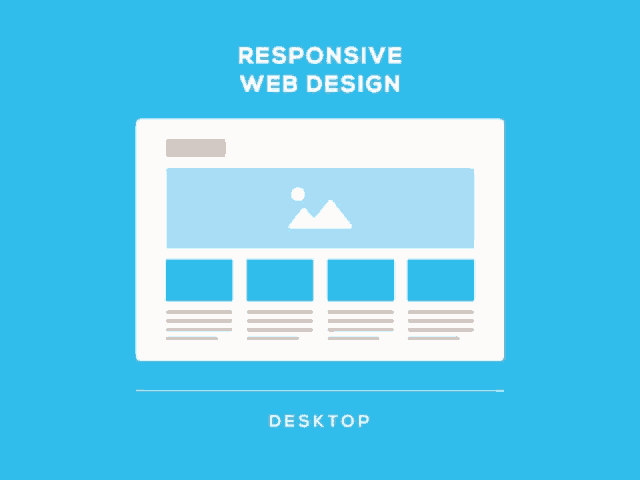
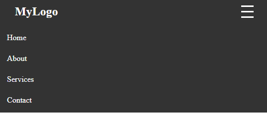

<!--
_class: lead
_paginate: skip
-->

# Responsive Web Design



---

## **Pengenalan Responsive Web Design**

**Responsive Web Design (RWD)** adalah pendekatan desain web yang membuat tampilan website menyesuaikan diri secara otomatis terhadap ukuran layar perangkat—baik desktop, tablet, maupun smartphone.

---

### Tujuan:

- Menyediakan pengalaman pengguna optimal di semua perangkat
- Mengurangi kebutuhan membuat versi website berbeda untuk tiap perangkat

---

## **Viewport dan Meta Tag**

Untuk memastikan halaman responsif di perangkat mobile, tambahkan tag berikut di dalam `<head>`:


---

```html
<meta name="viewport" content="width=device-width,initial-scale=1.0" />
```

**Penjelasan:**

- `width=device-width`: Mengatur lebar viewport sesuai dengan lebar layar perangkat
- `initial-scale=1.0`: Menentukan zoom awal saat halaman dimuat

---

## **Fluid Layout dengan Persentase dan max-width**

Daripada menggunakan satuan tetap / absolute (seperti px), gunakan satuan relatif:

```css
.container {
  width: 90%;
  max-width: 1200px;
  margin: 0 auto;
}
```

**Penjelasan:**

- `width: 90%`: Elemen menyesuaikan dengan 90% dari lebar layar
- `max-width`: Membatasi lebar maksimal agar tidak terlalu lebar di layar besar

---

## Responsive Images

```css
img {
  width: 90%;
  max-width: 1200px;
  height: auto;
}
```

---

## Typography Responsif

```css
body {
  font-size: 1.2rem;
}
```

---

## **Media Queries**

**Media Queries** memungkinkan kita menerapkan CSS khusus berdasarkan lebar layar.

```css
@media (max-width: 768px) {
  selector {
    property: value;
  }
}
```

---

```css
/* Gaya default (desktop) */
nav {
  display: flex;
  justify-content: space-between;
}

/* Gaya untuk layar kecil (mobile) */
@media (max-width: 768px) {
  nav {
    flex-direction: column;
    align-items: center;
  }
}
```

---

## Common Media Query Breakpoints

| **Device Type**       | **Breakpoint (px)** | **Media Query Example**      |
| --------------------- | ------------------- | ---------------------------- |
| Extra Small (Mobile)  | `max-width: 480px`  | `@media (max-width: 480px)`  |
| Small (Mobile)        | `max-width: 576px`  | `@media (max-width: 576px)`  |
| Medium (Tablet)       | `max-width: 768px`  | `@media (max-width: 768px)`  |
| Large (Small Laptop)  | `max-width: 992px`  | `@media (max-width: 992px)`  |
| Extra Large (Desktop) | `max-width: 1200px` | `@media (max-width: 1200px)` |
| XXL (Large Desktop)   | `max-width: 1400px` | `@media (max-width: 1400px)` |

---

## **Navigasi Responsif (Hamburger Menu)**




---

```html
<nav class="navbar">
  <div class="logo">MyLogo</div>
  <ul class="nav-links" id="navLinks">
    <li><a href="#">Home</a></li>
    <li><a href="#">About</a></li>
    <li><a href="#">Services</a></li>
    <li><a href="#">Contact</a></li>
  </ul>
  <div class="hamburger" id="hamburger">
    <span></span>
    <span></span>
    <span></span>
  </div>
</nav>
```

---

```css
.navbar {
  display: flex;
  justify-content: space-between;
  align-items: center;
  padding: 1rem 2rem;
  background-color: #333;
  color: #fff;
}

.logo {
  font-size: 1.5rem;
  font-weight: bold;
}
```

---

```css
.nav-links {
  list-style: none;
  display: flex;
  gap: 1.5rem;
}

.nav-links li a {
  color: white;
  text-decoration: none;
}

.nav-links li a:hover {
  color: #00bcd4;
}
```

---

```css
.hamburger {
  display: none;
  flex-direction: column;
  cursor: pointer;
}

.hamburger span {
  height: 3px;
  width: 25px;
  background: white;
  margin: 4px 0;
  transition: 0.4s;
}
```

---

```css
/* Responsive */
@media (max-width: 768px) {
  .nav-links {
    display: none;
    flex-direction: column;
    width: 100%;
    background: #333;
    position: absolute;
    top: 60px;
    left: 0;
    padding: 1rem;
  }

  .nav-links.active {
    display: flex;
  }

  .hamburger {
    display: flex;
  }
}
```

---

```javascript
const hamburger = document.getElementById("hamburger");
const navLinks = document.getElementById("navLinks");

hamburger.addEventListener("click", () => {
  navLinks.classList.toggle("active");
});
```
